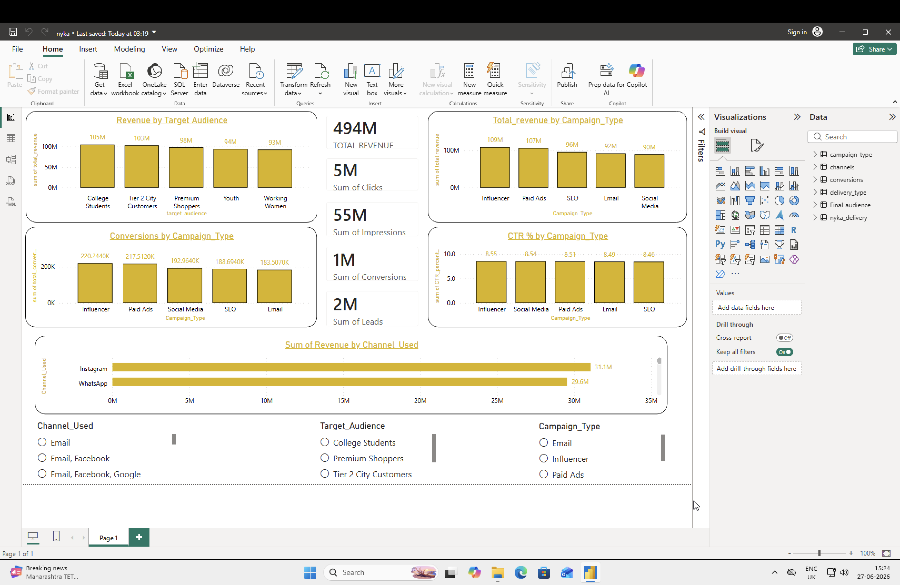

# 📊 Marketing Campaign Performance Analysis

## Overview

This project analyzes the performance of marketing campaigns using SQL, Excel, and Power BI. The objective is to identify high-performing campaigns, understand customer behavior, evaluate marketing channels, and generate actionable business insights.

---

## Dataset

- Source: Kaggle (Nykaa Marketing Campaign Dataset)

---

## Tools Used

- SQL (MySQL)
- Microsoft Excel
- Power BI

---

## Project Workflow

1. Downloaded the dataset from Kaggle.
2. Cleaned and transformed raw data using SQL.
3. Answered business questions using SQL queries.
4. Performed analysis with Excel Pivot Tables and Charts.
5. Built an interactive dashboard in Power BI.

---

## Business Questions Answered

- Which campaign type generated the highest revenue?
- Which marketing channel performed best?
- Which audience segment generated the highest revenue?
- Which campaign achieved the highest CTR?
- Which campaign generated the highest conversions?
- How many clicks, leads, impressions and conversions were generated?
- Which campaigns should receive higher marketing investment?

---

## Dashboard Preview

---

## Key Insights

- Influencer campaigns generated the highest revenue.
- Social Media campaigns delivered the strongest conversion performance.
- Premium Shoppers were the highest-value customer segment.
- Instagram and WhatsApp were the most effective marketing channels.
- Campaign CTR remained consistently around 8.5%.

---

## Files Included

- SQL Queries
- Excel Analysis
- Power BI Dashboard
- Dashboard Screenshot
- Dataset

---

## Skills Demonstrated

- SQL
- Data Cleaning
- Data Analysis
- Excel
- Pivot Tables
- Power BI
- Dashboard Design
- Business Intelligence
